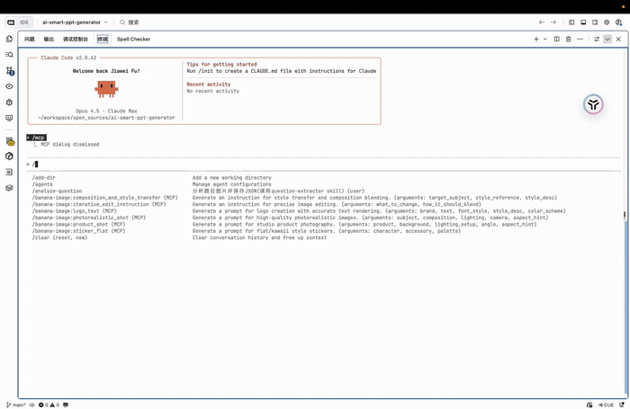

<a id="readme-top"></a>

<!-- PROJECT SHIELDS -->
<div align="center">

[![Contributors][contributors-shield]][contributors-url]
[![Forks][forks-shield]][forks-url]
[![Stargazers][stars-shield]][stars-url]
[![Issues][issues-shield]][issues-url]
[![MIT License][license-shield]][license-url]
[![PyPI version][pypi-shield]][pypi-url]
[![Downloads][downloads-shield]][pypi-url]

</div>

<!-- PROJECT LOGO -->
<br />
<div align="center">
  <a href="https://github.com/zengwenliang416/banana-image-mcp">
    
  </a>

  <h1 align="center">Banana Image MCP</h1>

  <p align="center">
    <b>Let Claude Generate Stunning 4K Images for You</b>
    <br />
    An MCP server that brings AI image generation to Claude Desktop
    <br />
    <br />
    <a href="#quick-start"><strong>Quick Start</strong></a>
    &nbsp;&middot;&nbsp;
    <a href="https://github.com/zengwenliang416/banana-image-mcp/issues/new?labels=bug">Report Bug</a>
    &nbsp;&middot;&nbsp;
    <a href="https://github.com/zengwenliang416/banana-image-mcp/issues/new?labels=enhancement">Request Feature</a>
  </p>

  <p align="center">
    <a href="./README_CN.md">中文</a>
  </p>
</div>

<!-- DEMO GIF -->
<div align="center">
  
</div>
<br />

<!-- ABOUT THE PROJECT -->

## About The Project

**Banana Image MCP** is a production-ready [MCP (Model Context Protocol)](https://modelcontextprotocol.io/) server that enables Claude and other AI assistants to generate high-quality images using Google's latest Gemini image models.

Simply describe what you want, and Claude will create it — from quick concept sketches to stunning **4K professional artwork**.

### Why Banana Image MCP?

- **Zero Setup Complexity** — Just add your API key and start generating
- **Production Ready** — Built with FastMCP framework, fully tested, CI/CD enabled
- **Best Quality** — Leverages Gemini's most advanced image models with 4K support
- **Smart Defaults** — Intelligent model selection based on your prompts
- **Real-World Knowledge** — Google Search grounding for accurate, factual images

<p align="right">(<a href="#readme-top">back to top</a>)</p>

### Built With

* [![Python][Python-badge]][Python-url]
* [![FastMCP][FastMCP-badge]][FastMCP-url]
* [![Google Gemini][Gemini-badge]][Gemini-url]
* [![uv][uv-badge]][uv-url]

<p align="right">(<a href="#readme-top">back to top</a>)</p>

<!-- FEATURES -->
## Features

<table>
<tr>
<td width="50%">

### 4K Ultra HD Output
Generate images up to **3840px** with the Pro model. Perfect for professional work, marketing materials, and print-ready assets.

</td>
<td width="50%">

### Dual Model Support
- **Flash**: 2-3s, up to 1024px — for quick iterations
- **Pro**: 5-8s, up to 4K — for final deliverables

</td>
</tr>
<tr>
<td width="50%">

### Smart Model Selection
The server automatically picks the best model based on your prompt. Say "quick sketch" for Flash, or "4K professional" for Pro.

</td>
<td width="50%">

### Google Search Grounding
Pro model uses real-world knowledge from Google Search to generate more accurate and factual images.

</td>
</tr>
<tr>
<td width="50%">

### Flexible Aspect Ratios
Support for all common ratios: `1:1`, `16:9`, `9:16`, `4:3`, `3:2`, `21:9` and more.

</td>
<td width="50%">

### Natural Language Editing
Edit existing images with simple text commands like "make the sky more dramatic" or "remove the background".

</td>
</tr>
</table>

<p align="right">(<a href="#readme-top">back to top</a>)</p>

<!-- GETTING STARTED -->
## Quick Start

Get up and running in under 2 minutes.

### Prerequisites

* Get a **free** Gemini API key from [Google AI Studio](https://aistudio.google.com/apikey)
* Have [Claude Desktop](https://claude.ai/download) installed

### Installation

**Add to your Claude Desktop config file:**

```json
{
  "mcpServers": {
    "banana-image": {
      "command": "uvx",
      "args": ["banana-image-mcp"],
      "env": {
        "GEMINI_API_KEY": "your-api-key-here"
      }
    }
  }
}
```

<details>
<summary>📁 <b>Config file locations</b></summary>

| Platform | Path |
|----------|------|
| **macOS** | `~/Library/Application Support/Claude/claude_desktop_config.json` |
| **Windows** | `%APPDATA%\Claude\claude_desktop_config.json` |
| **Linux** | `~/.config/Claude/claude_desktop_config.json` |

</details>

<details>
<summary>🔄 <b>Updating to the latest version</b></summary>

When using `uvx`, packages are cached locally. To get the latest version:

```bash
# Clear the cache for this package
uv cache clean banana-image-mcp

# Then restart Claude Desktop
```

Or specify a version explicitly in your config:

```json
"args": ["banana-image-mcp==1.0.1"]
```

</details>

<details>
<summary>🔌 <b>Other MCP clients (Cursor, VS Code, Cline, etc.)</b></summary>

The configuration is the same for other MCP-compatible clients. Just add the server config to your client's MCP configuration file.

</details>

<p align="right">(<a href="#readme-top">back to top</a>)</p>

<!-- USAGE EXAMPLES -->
## Usage

Just ask Claude to generate images naturally:

```text
"Generate a cute cat wearing a space suit"

"Create a professional product photo of a coffee cup, 4K quality"

"Make a 16:9 YouTube thumbnail about cooking"

"Edit this image: make the sky more dramatic"
```

### Model Comparison

| Model | Speed | Max Resolution | Best For |
|-------|-------|----------------|----------|
| **Gemini 2.5 Flash** | 2-3s | 1024px | Quick drafts, iterations, prototypes |
| **Gemini 3 Pro** | 5-8s | **4K (3840px)** | Final assets, marketing, professional work |

The server **defaults to Pro model** for best quality. Control it with keywords:

| Say this... | Model Used |
|-------------|------------|
| "quick sketch", "draft", "prototype" | Flash |
| "4K", "professional", "high quality" | Pro |
| (default) | Pro |

### Parameters Reference

| Parameter | Type | Default | Description |
|-----------|------|---------|-------------|
| `prompt` | string | required | Image description |
| `model_tier` | string | `"pro"` | `"flash"`, `"pro"`, or `"auto"` |
| `resolution` | string | `"4k"` | `"1k"`, `"2k"`, `"4k"`, `"high"` |
| `aspect_ratio` | string | - | `"1:1"`, `"16:9"`, `"9:16"`, `"4:3"`, `"21:9"`, etc. |
| `thinking_level` | string | `"high"` | `"low"` or `"high"` (Pro only) |
| `enable_grounding` | bool | `true` | Enable Google Search grounding (Pro only) |
| `n` | int | `1` | Number of images (1-4) |
| `negative_prompt` | string | - | What to avoid in the image |

### Environment Variables

| Variable | Required | Default | Description |
|----------|----------|---------|-------------|
| `GEMINI_API_KEY` | **Yes** | - | Your Gemini API key |
| `IMAGE_OUTPUT_DIR` | No | `~/banana-images` | Where to save generated images |

<p align="right">(<a href="#readme-top">back to top</a>)</p>

<!-- USE CASES -->
## What You Can Create

<table>
<tr>
<td align="center" width="33%">
<b>Product Photography</b><br/>
Professional shots with studio lighting
</td>
<td align="center" width="33%">
<b>Concept Art</b><br/>
Fantasy landscapes, character designs
</td>
<td align="center" width="33%">
<b>Marketing Materials</b><br/>
Social graphics, banners, thumbnails
</td>
</tr>
<tr>
<td align="center" width="33%">
<b>Technical Diagrams</b><br/>
Flowcharts, architecture diagrams
</td>
<td align="center" width="33%">
<b>Photo-realistic Images</b><br/>
Portraits, nature, urban photography
</td>
<td align="center" width="33%">
<b>UI/UX Mockups</b><br/>
App interfaces, web designs
</td>
</tr>
</table>

<p align="right">(<a href="#readme-top">back to top</a>)</p>

<!-- ROADMAP -->
## Roadmap

- [x] 4K resolution output (up to 3840px)
- [x] Dual model support (Flash + Pro)
- [x] Google Search grounding
- [x] Flexible aspect ratios
- [x] Natural language image editing
- [x] GitHub Actions CI/CD
- [ ] Batch image generation
- [ ] Image-to-image transformation
- [ ] Video generation support
- [ ] Local model support (Ollama)

See the [open issues](https://github.com/zengwenliang416/banana-image-mcp/issues) for a full list of proposed features and known issues.

<p align="right">(<a href="#readme-top">back to top</a>)</p>

<!-- DEVELOPMENT -->
## Development

```bash
# Clone the repository
git clone https://github.com/zengwenliang416/banana-image-mcp.git
cd banana-image-mcp

# Install dependencies
uv sync

# Run in development mode
fastmcp dev banana_image_mcp.server:create_app

# Run tests
pytest

# Lint and format
ruff check .
ruff format .
```

<p align="right">(<a href="#readme-top">back to top</a>)</p>

<!-- CONTRIBUTING -->
## Contributing

Contributions make the open source community amazing. Any contributions you make are **greatly appreciated**.

1. Fork the Project
2. Create your Feature Branch (`git checkout -b feature/AmazingFeature`)
3. Commit your Changes (`git commit -m 'Add some AmazingFeature'`)
4. Push to the Branch (`git push origin feature/AmazingFeature`)
5. Open a Pull Request

<p align="right">(<a href="#readme-top">back to top</a>)</p>

<!-- LICENSE -->
## License

Distributed under the MIT License. See `LICENSE` for more information.

<p align="right">(<a href="#readme-top">back to top</a>)</p>

<!-- CONTACT -->
## Contact

Wenliang Zeng - [@zengwenliang416](https://github.com/zengwenliang416)

Project Link: [https://github.com/zengwenliang416/banana-image-mcp](https://github.com/zengwenliang416/banana-image-mcp)

<p align="right">(<a href="#readme-top">back to top</a>)</p>

<!-- ACKNOWLEDGMENTS -->
## Acknowledgments

* [FastMCP](https://github.com/jlowin/fastmcp) - The MCP framework that powers this server
* [Google Gemini](https://ai.google.dev/) - The AI models behind image generation
* [Anthropic MCP](https://modelcontextprotocol.io/) - The protocol specification
* [Best-README-Template](https://github.com/othneildrew/Best-README-Template) - README inspiration

<p align="right">(<a href="#readme-top">back to top</a>)</p>

<!-- MARKDOWN LINKS & IMAGES -->
[contributors-shield]: https://img.shields.io/github/contributors/zengwenliang416/banana-image-mcp.svg?style=for-the-badge
[contributors-url]: https://github.com/zengwenliang416/banana-image-mcp/graphs/contributors
[forks-shield]: https://img.shields.io/github/forks/zengwenliang416/banana-image-mcp.svg?style=for-the-badge
[forks-url]: https://github.com/zengwenliang416/banana-image-mcp/network/members
[stars-shield]: https://img.shields.io/github/stars/zengwenliang416/banana-image-mcp.svg?style=for-the-badge
[stars-url]: https://github.com/zengwenliang416/banana-image-mcp/stargazers
[issues-shield]: https://img.shields.io/github/issues/zengwenliang416/banana-image-mcp.svg?style=for-the-badge
[issues-url]: https://github.com/zengwenliang416/banana-image-mcp/issues
[license-shield]: https://img.shields.io/github/license/zengwenliang416/banana-image-mcp.svg?style=for-the-badge
[license-url]: https://github.com/zengwenliang416/banana-image-mcp/blob/main/LICENSE
[pypi-shield]: https://img.shields.io/pypi/v/banana-image-mcp?style=for-the-badge&color=blue
[pypi-url]: https://pypi.org/project/banana-image-mcp/
[downloads-shield]: https://img.shields.io/pypi/dm/banana-image-mcp?style=for-the-badge&color=green

[Python-badge]: https://img.shields.io/badge/Python-3.11+-3776AB?style=for-the-badge&logo=python&logoColor=white
[Python-url]: https://www.python.org/
[FastMCP-badge]: https://img.shields.io/badge/FastMCP-2.0+-00ADD8?style=for-the-badge
[FastMCP-url]: https://github.com/jlowin/fastmcp
[Gemini-badge]: https://img.shields.io/badge/Google_Gemini-4285F4?style=for-the-badge&logo=google&logoColor=white
[Gemini-url]: https://ai.google.dev/
[uv-badge]: https://img.shields.io/badge/uv-Package_Manager-DE5FE9?style=for-the-badge
[uv-url]: https://github.com/astral-sh/uv
